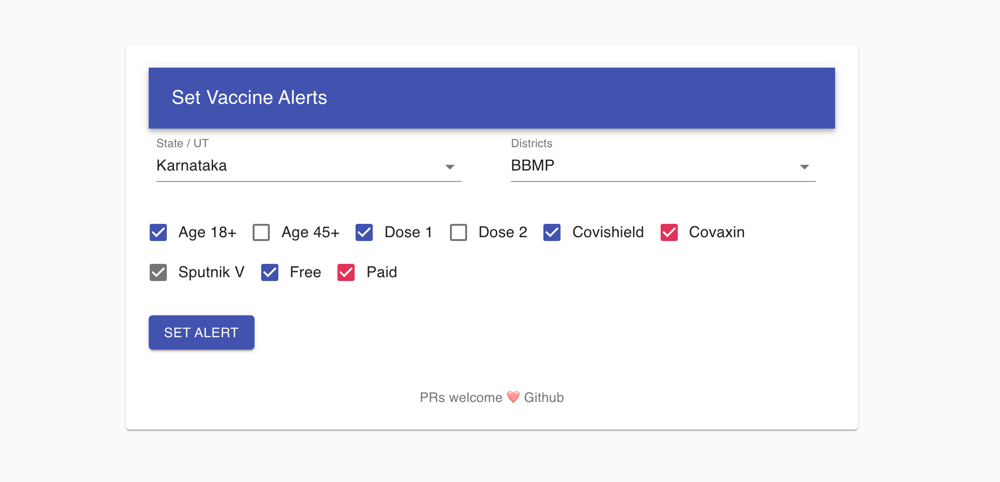
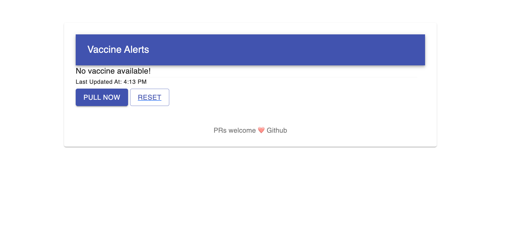
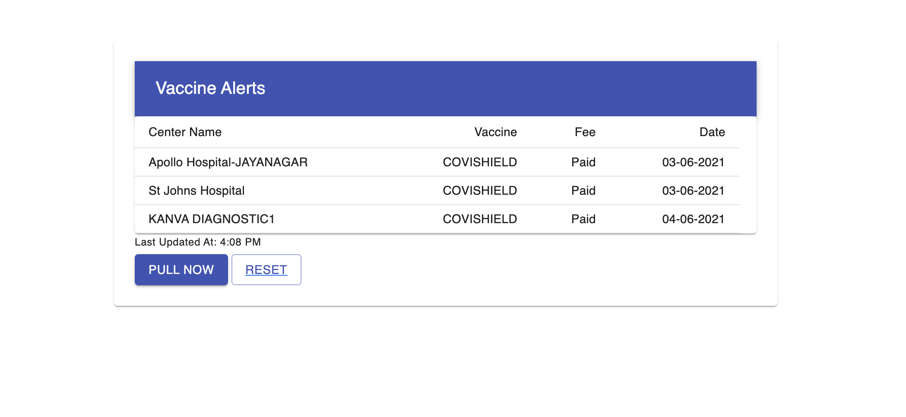

# covid-vaccine-alert

#### Set Alert



#### Get Alert



#### Vaccine Available



## Installation

### Prerequisite :

Install NodeJS(https://nodejs.org/) LTS version

```
git clone https://github.com/anupjha/covid-vaccine-alert.git
cd covid-vaccine-alert
npm i
```

## Usage

### Development server

```bash
npm start
```

You can view the development server at `localhost:3000`
(change port in ./config/webpack.dev.js)

### Unit Test

```bash
npm test
```

### Production build

```bash
npm run build
``
```
